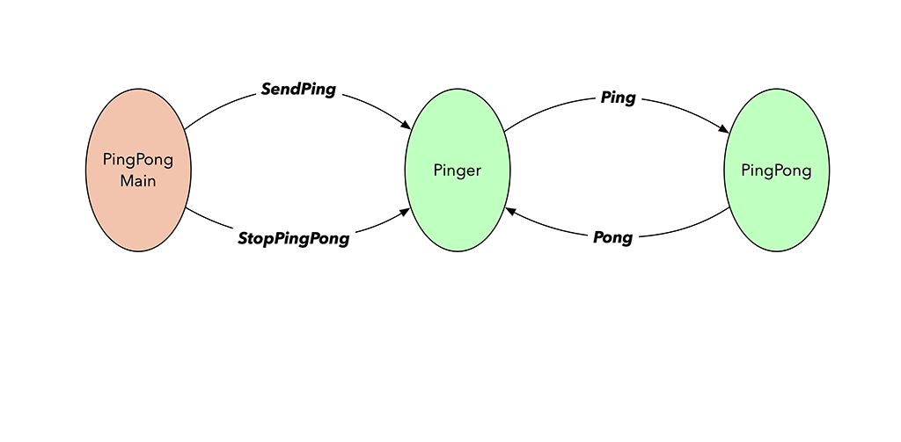
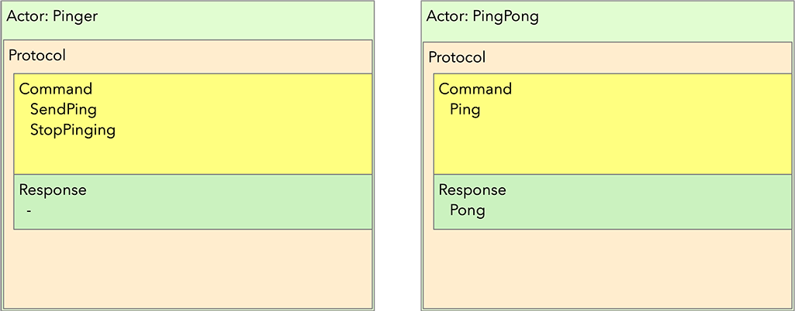
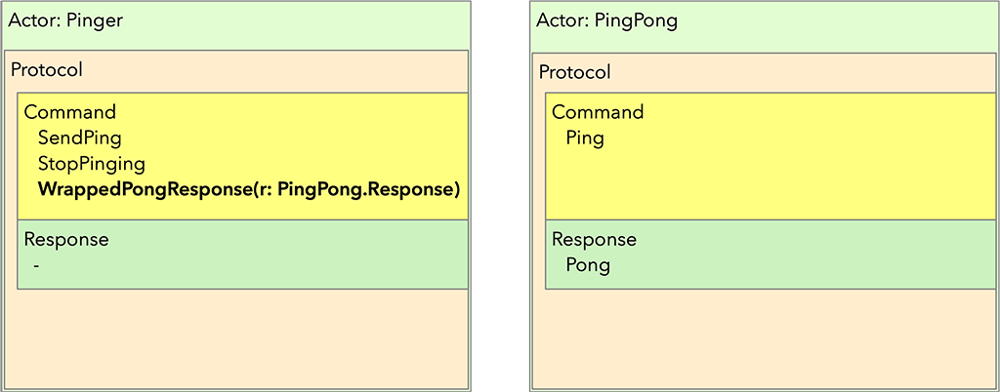
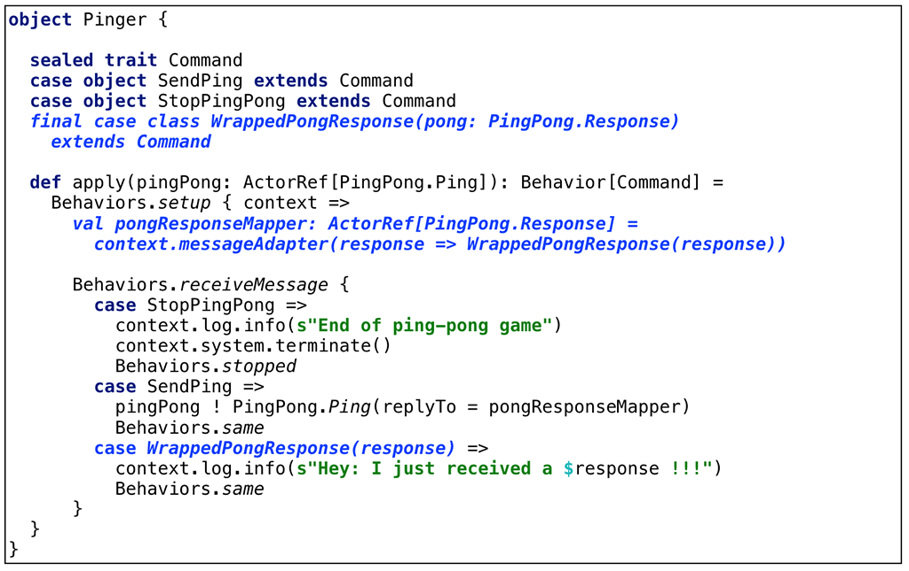

# A bare-bones Akka Application using Akka Typed

This application implements a simple request/response interaction using:

- Akka 2.6.1
- Akka Typed APIs
- Scala 2.13.1

Two actors are implemented: `Pinger` and `PingPong`. The main program controls
what happens by sending a `SendPing` message to the `Pinger` actor. This will
trigger the `Pinger` actor to send a `Ping` message to the `PingPong` actor. The `PingPong` actor responds to the `Pinger` actor with a `Pong` message.

The main program repeats sending of the `SendPing` message 10 times after which it sends a `StopPingingMessage` to the `Pinger` actor. After receiving the `StopPingingMessage`, the `Pinger` terminates the `ActorSystem` and the application is stopped.



The following diagram shows the core message protocol of both actors in its base form. The protocol has two components: `Command` and `Response`: the former is a container with all the messages that the actor "understands" whereas the latter is a container that holds the messages the actor can send in response to a command.



Akka Typed brings a solution to the typical issue in Akka Classic, namely it will reenforce adherence to and actor's message protocol. A few of the consequences of introducing strong typing in the actor protocol are:

- there's no longer an implicit `sender()` to facilitate replying to the sender of a message. Instead, an explicit `replyTo` ActorRef has to be sent as part of the original message to allow the receiving actor to send a message back;
- the protocol of an actor _**has**_ to be defined as part of its implementation which helps both the developer and anyone reading the code;
- in case an Akka Typed based application is changed, the compiler will be a major tool during the refactoring because everything is statically typed. This will lower the probability of introducing errors.

On a side note: I refactored an existing application coded with Akka Classic to Akka Typed and even though it took me some time to get everything converted and compile without errors, the application ran correctly on first try! It reminded me of a comment made by Martin Odersky during the first "Functional Programming Principles with Scala" course on Coursera along the lines of _"If you can make your application compile without errors, chances are that it will also work correctly on first run"_. Another major takeaway from the refactoring experience is that it allowed me to spot an inconsistency in the way I used the protocols of the different actors: with the protocol spelled out in detail, one can spot these kind of inconsistencies very easily.

There's one small problem to solve though: in our sample application, the `Pong` response from the `PingPong` actor is not part of the protocol of the `Pinger` actor. In Scala 2, this problem is solved by using a so called message adapter: the actor that receives a response from another actor needs to extend its `Command` set in some way to receive these messages. This in done by:

- Wrapping responses in a container;
- Adding the container message type to the `Command` set of the receiving actor;
- Generating an `ActorRef` of the appropriate type in the requesting actor and pass it to the actor that will respond in a `replyTo` field.

The full protocol of the actors now looks as follows:



Translated to code, this looks as follows:



A clean solution to the problem of making responses understood by the receiving actor, but it does look like adding boilerplate and it distracts the code reader from the core functionality.

We will be able to do a lot better when using Dotty (which will become Scala 3). Check out the master branch of this project for more details.

# Running the example

- `sbt run`

### Sample output

```
/lbt/dottyAkkatest on scala-2-base-version 17:03:40
$ sbt run
[info] Loading settings for project global-plugins from idea.sbt ...
[info] Loading global plugins from /Users/ericloots/.sbt/1.0/plugins
[info] Loading settings for project dottyakkatest-build from plugins.sbt ...
[info] Loading project definition from /lbt/dottyAkkatest/project
[info] Loading settings for project root from build.sbt ...
[info] Set current project to dotty-simple (in build file:/lbt/dottyAkkatest/)
[info] Running org.test.akka.PingPongMain
17:03:51.974 [ping-pong-system-akka.actor.default-dispatcher-3] INFO akka.event.slf4j.Slf4jLogger - Slf4jLogger started
SLF4J: A number (1) of logging calls during the initialization phase have been intercepted and are
SLF4J: now being replayed. These are subject to the filtering rules of the underlying logging system.
SLF4J: See also http://www.slf4j.org/codes.html#replay
17:03:52.037 [ping-pong-system-akka.actor.default-dispatcher-6] INFO org.test.akka.Pinger$ - Hey: I just received a Pong !!!
17:03:53.036 [ping-pong-system-akka.actor.default-dispatcher-5] INFO org.test.akka.Pinger$ - Hey: I just received a Pong !!!
17:03:54.038 [ping-pong-system-akka.actor.default-dispatcher-5] INFO org.test.akka.Pinger$ - Hey: I just received a Pong !!!
17:03:55.043 [ping-pong-system-akka.actor.default-dispatcher-5] INFO org.test.akka.Pinger$ - Hey: I just received a Pong !!!
17:03:56.044 [ping-pong-system-akka.actor.default-dispatcher-5] INFO org.test.akka.Pinger$ - Hey: I just received a Pong !!!
17:03:57.044 [ping-pong-system-akka.actor.default-dispatcher-5] INFO org.test.akka.Pinger$ - Hey: I just received a Pong !!!
17:03:58.048 [ping-pong-system-akka.actor.default-dispatcher-5] INFO org.test.akka.Pinger$ - Hey: I just received a Pong !!!
17:03:59.051 [ping-pong-system-akka.actor.default-dispatcher-5] INFO org.test.akka.Pinger$ - Hey: I just received a Pong !!!
17:04:00.052 [ping-pong-system-akka.actor.default-dispatcher-5] INFO org.test.akka.Pinger$ - Hey: I just received a Pong !!!
17:04:01.056 [ping-pong-system-akka.actor.default-dispatcher-5] INFO org.test.akka.Pinger$ - Hey: I just received a Pong !!!
17:04:02.059 [ping-pong-system-akka.actor.default-dispatcher-5] INFO org.test.akka.Pinger$ - End of the ping-pong game - calling it a day!
[success] Total time: 12 s, completed Dec 20, 2019 5:04:02 PM

/lbt/dottyAkkatest on scala-2-base-version 17:04:02/
```
